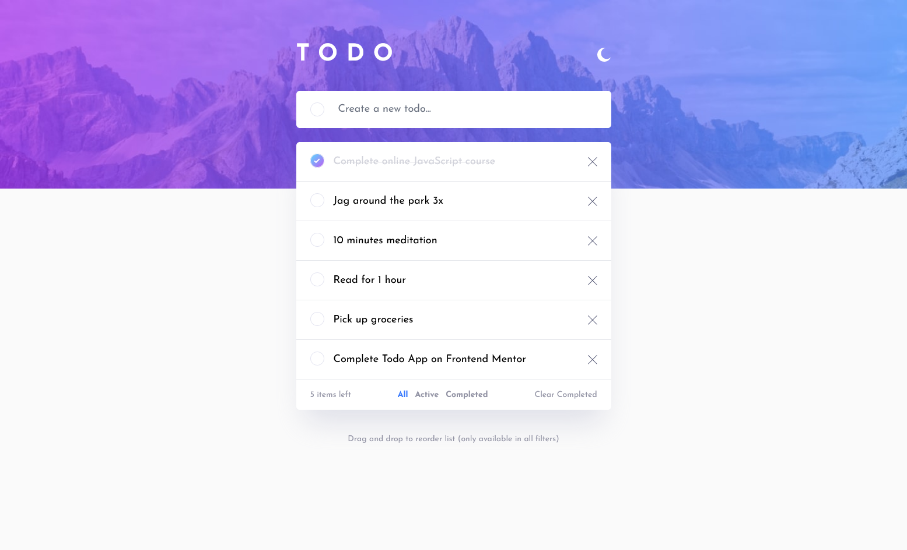

# Frontend Mentor - Todo app solution

This is a solution to the [Todo app challenge on Frontend Mentor](https://www.frontendmentor.io/challenges/todo-app-Su1_KokOW). Frontend Mentor challenges help you improve your coding skills by building realistic projects.

## Table of contents

- [Overview](#overview)
  - [The challenge](#the-challenge)
  - [Screenshot](#screenshot)
  - [Links](#links)
- [My process](#my-process)
  - [Built with](#built-with)
  - [Useful resources](#useful-resources)
- [Author](#author)

## Overview

### The challenge

Users should be able to:

- View the optimal layout for the app depending on their device's screen size
- See hover states for all interactive elements on the page
- Add new todos to the list
- Mark todos as complete
- Delete todos from the list
- Filter by all/active/complete todos
- Clear all completed todos
- Toggle light and dark mode
- Drag and drop to reorder items on the list only available in **all** filters

### Screenshot

### Links

- Live Site URL: [Live site](https://todo-hatp3bbw9-henr1quecruzs-projects.vercel.app/)

## My process

### Built with

- Semantic HTML5 markup
- Tailwind
- Flexbox
- [React](https://reactjs.org/) - JS library

### Useful resources

- [Framer Motion](https://www.framer.com/motion/) - This helped me implement the drag and drop functionality.

## Author

- Frontend Mentor - [@Henr1queCruz](https://www.frontendmentor.io/profile/Henr1queCruz)
